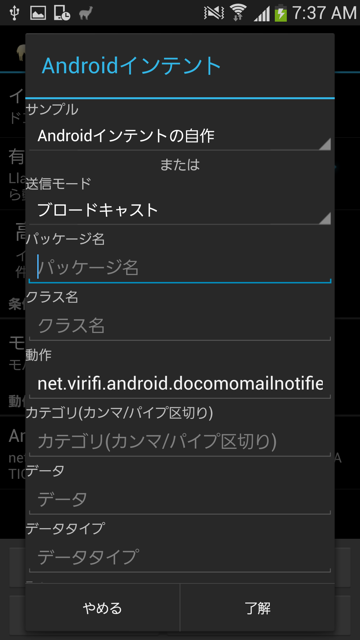

DocomoMailNotifier
================

ドコモメールにメール着信通知を送信するアプリです。IntentによりTaskerやLlamaと連携することが可能です。	

Taskerとの連携方法
===========================

Action Edit > Misc > Send Intent において、

* Actionに「net.virifi.android.docomomailnotifier.SEND_NOTIFICATION」を入力
* Targetを「Broadcast Receiver」に設定

Llamaとの連携方法
============================	

イベント編集 > 動作追加 > Androidインテント において、

* 送信モードを「ブロードキャスト」に設定
* 動作に「net.virifi.android.docomomailnotifier.SEND_NOTIFICATION」を入力

Source code license
===================

This project is subject to the [Apache License, Version 2.0](http://apache.org/licenses/LICENSE-2.0.html).

Library licenses
================

Butter Knife is subject to the [Apache License, Version 2.0](http://apache.org/licenses/LICENSE-2.0.html).
More information on [the official web site](http://jakewharton.github.io/butterknife/).
